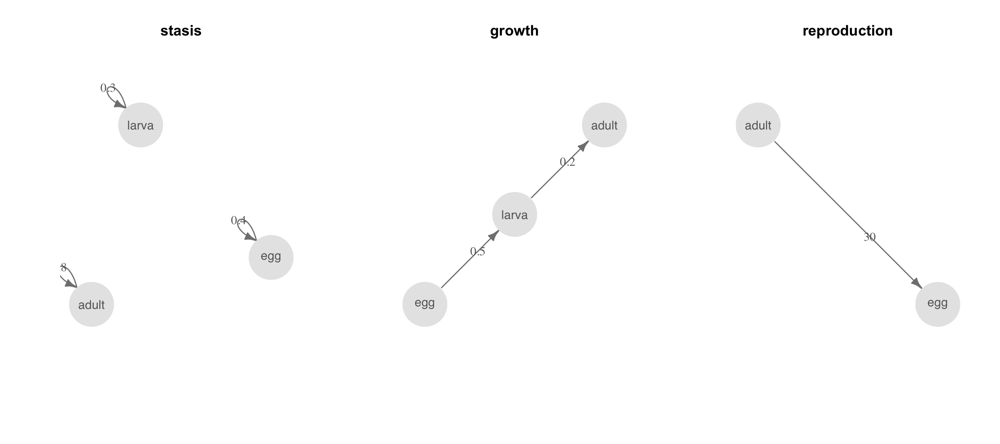
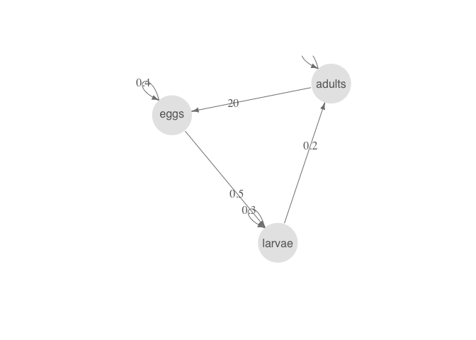
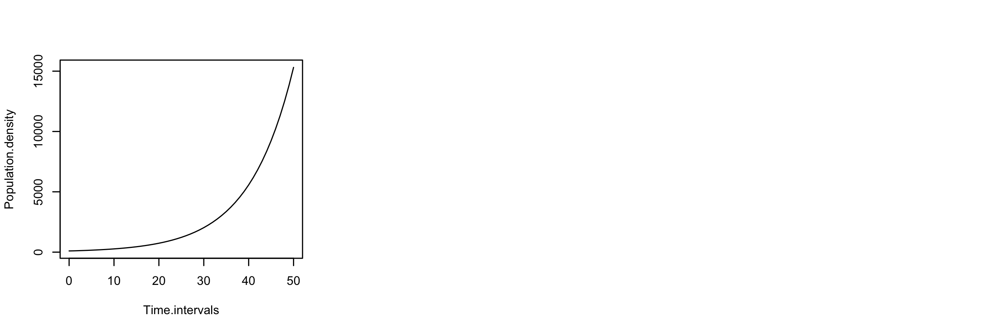
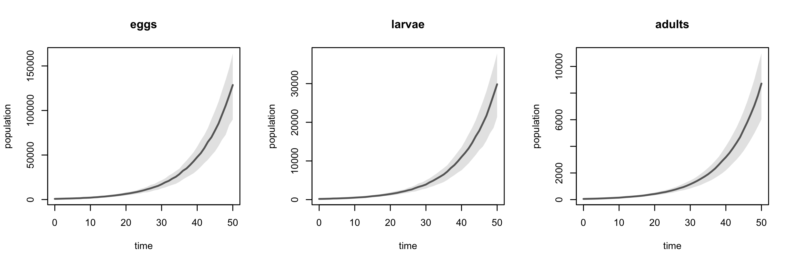
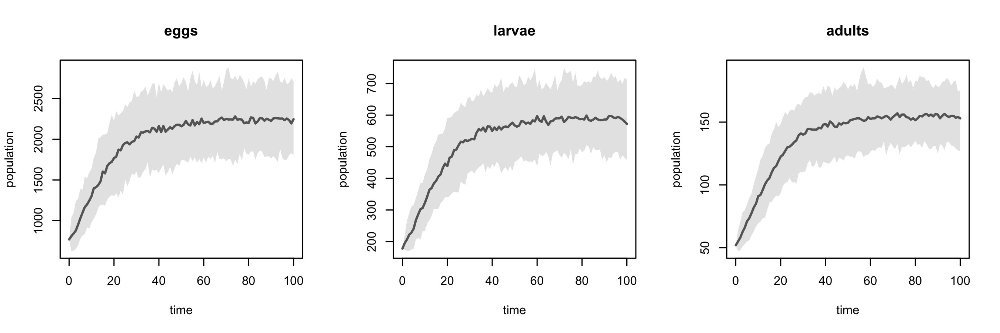
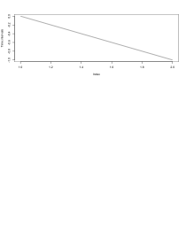

pop
===

### A Flexible Syntax for Population Dynamic Modelling

[](https://travis-ci.org/goldingn/pop) [](https://codecov.io/github/goldingn/pop?branch=master) [](https://cran.rstudio.com/web/packages/pop)

Population dynamic models underpin a range of analyses and applications in ecology and epidemiology. The various approaches for fitting and analysing these models (MPMs, IPMs, ODEs, POMPs, PVA, with and without metapopulation structure) are generally fitted using different software, each with a different interface. This makes it difficult to combine various modelling approaches and data types to solve a given problem. pop aims to provide a flexible and easy to use common interface for constructing population dynamic models and enabling to them to be fitted and analysed in various ways.

This is a work in progress - so far you can only create simple dynamical models and not do very much with them. More will follow.

#### Installation

`pop` is not yet on CRAN, so the easiest way to install it is directly from GitHub using the `devtools` package (Windows users may need to download RTools first)

``` r
devtools::install_github('goldingn/pop')
library(pop)
```

#### Creating a simple population dynamic model

`dynamic` objects (created with the function `dynamic()`) are the core of `pop` since they encode dynamical systems, can be updated by fitting to data, and can be analysed in a variety of ways. `dynamic` objects are composed of a series of `transitions` encoding the links between different states in the dynamic. That's all a bit generic, so here's an example for a simple ecological population with three life stages (states).

First we define the different types of transitions between the states:

``` r
# probability of staying in the same step between timesteps
survival_egg <- tr(eggs ~ eggs, p(0.4))
survival_larva <- tr(larvae ~ larvae, p(0.3))
survival_adult <- tr(adults ~ adults, p(0.9))

# probability of moving to the next state
hatching <- tr(larvae ~ eggs, p(0.5))
pupation <- tr(adults ~ larvae, p(0.2))

# probability and number of eggs laid
prob_laying <- tr(eggs ~ adults, p(0.5))
fecundity <- tr(eggs ~ adults, r(30))
```

Next we can combine these to create dynamics (systems of transitions). We'll make these three different dynamics to start with:

``` r
survival <- dynamic(survival_egg,
                    survival_larva,
                    survival_adult)

growth <- dynamic(pupation,
                  hatching)

# we want the product of these two things, which we might estimate separately
recruitment <- dynamic(prob_laying * fecundity)
```

We can plot each of these to see what they look like schematically:

``` r
par(mfrow = c(1, 3))
plot(survival); title(main = 'survival')
plot(growth); title(main = 'growth')
plot(recruitment); title(main = 'recruitment')
```

<!-- -->

These components aren't particularly useful on their own though, so we should combine them into one overall population dynamic:

``` r
# note that the order of transitions in the dynamic determines the order in
# which transitions occur, and may influence the dynamics.
all <- dynamic(survival,
               growth,
               recruitment)
               
par(mfrow = c(1, 2))
plot(all)
```

<!-- -->

#### Doing things with models

We can convert any of these objects into transition matrices, and analyse them deterministically using functions from other matrix population model packages, like `popbio` and `popdemo`:

``` r
(A <- as.matrix(all))
```

    ##        eggs larvae adults
    ## eggs    0.2   0.00   13.5
    ## larvae  0.2   0.24    0.0
    ## adults  0.0   0.06    0.9
    ## attr(,"class")
    ## [1] "matrix"            "transition_matrix"

``` r
# estimate the intrinsic growth rate & stable stage distribution
popbio::lambda(A)
```

    ## [1] 1.106324

``` r
(ss <- popbio::stable.stage(A))
```

    ##       eggs     larvae     adults 
    ## 0.77041868 0.17785915 0.05172217

``` r
# get a reasonable initial population
population <- round(ss * 1000)

# plot deterministic trajectory from this population
par(mfrow = c(1, 3))
plot(popdemo::project(A, population, time = 50))
```

<!-- -->

We can also use the function `simulation` to carry out discrete-time stochastic simulations from dynamic objects:

``` r
# simulate 30 times for 50 generations each
sim <- simulation(dynamic = all,
                  population = population,
                  timesteps = 50,
                  replicates = 30)

# plot abundance of the three life stages
par(mfrow = c(1, 3))
plot(sim)
```

<!-- -->

#### Density dependence

`pop` now supports user-defined transition functions, where the parameter may depend on other things, like the population size, patch area or other environmental drivers.

We can use this functionality to update the above simulation analysis with density-dependent adult survival (see `?as.transfun` for details on how to define bespoke transition functions):

``` r
# density-dependent adult survival function (patch is a required argument)
ddfun <- function (landscape) {
  adult_density <- population(landscape, 'adults') / area(landscape)
  param$p * exp(-adult_density / param$area)
}

# turn it into a transfun object
dd <- as.transfun(ddfun,
                  param = list(p = 0.9,
                               area = 1000),
                  type = 'probability')

# use it in a transition and update the dynamic
survival_adult_dd <- tr(adults ~ adults, dd)
all_dd <- dynamic(survival_egg,
                  survival_larva,
                  survival_adult_dd,
                  hatching,
                  prob_laying * fecundity,
                  pupation)

# run the simulation (a little longer and with more simulations this time)
sim_dd <- simulation(dynamic = all_dd,
                     population = population,
                     timesteps = 100,
                     replicates = 100)

# and plot it
par(mfrow = c(1, 3))
plot(sim_dd)
```

<!-- -->

While we used the `popdemo` function `project` to make deterministic projections from the earlier density-*independent* model, that approach can't account for the effect of density dependence. Instead, we can use `pop`'s `projection` function to make deterministic density-dependent projections:

``` r
# project for 100 time steps
proj_dd <- projection(dynamic = all_dd,
                      population = population,
                      timesteps = 100)

# and plot it
par(mfrow = c(1, 3))
plot(proj_dd)
```

<!-- -->
