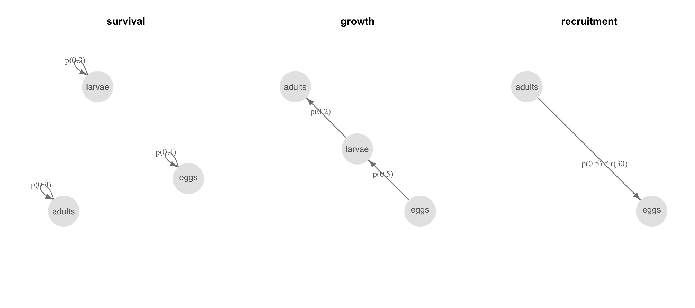
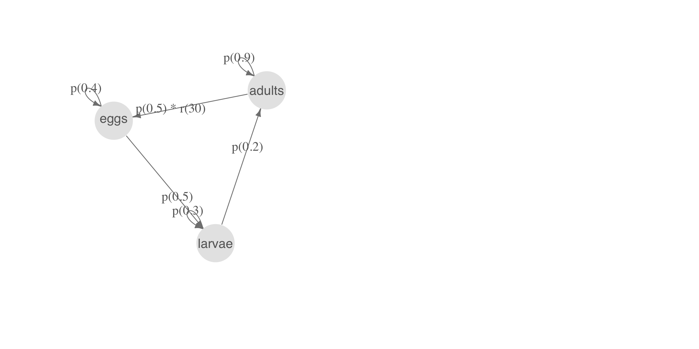
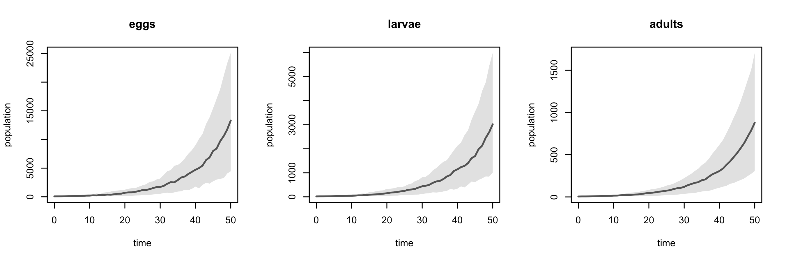
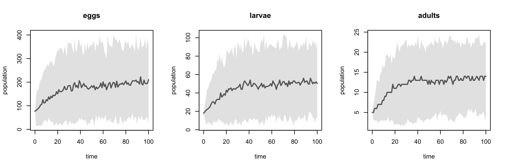
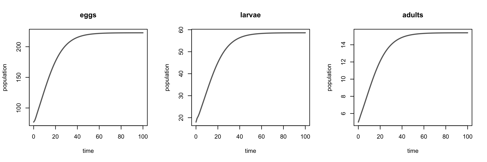
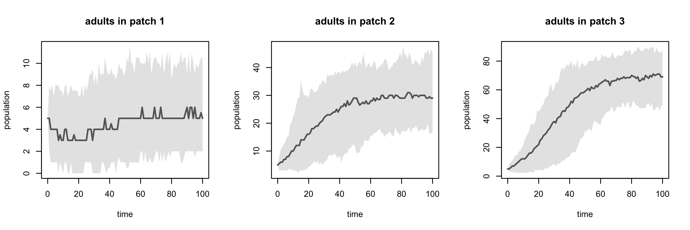

pop
===

### A Flexible Syntax for Population Dynamic Modelling

[](https://travis-ci.org/goldingn/pop) [](https://codecov.io/github/goldingn/pop?branch=master) [](https://cran.rstudio.com/web/packages/pop)

Population dynamic models underpin a range of analyses and applications in ecology and epidemiology. The various approaches for analysing population dynamics models (MPMs, IPMs, ODEs, POMPs, PVA) each require the model to be defined in a different way. This makes it difficult to combine different modelling approaches and data types to solve a given problem. `pop` aims to provide a flexible and easy to use common interface for constructing population dynamic models and enabling to them to be fitted and analysed in lots of different ways.

This package is a work in progress. So far you can create stage-structured dynamical models, add density dependence and metapopulation structure, convert them to transition matrices and project them into the future, both stochastically and deterministically. Future developments will add continuous traits (for e.g. age- and size-structured models) and support for fitting these models against various data types.

#### Installation

`pop` is now on [CRAN](https://cran.r-project.org/package=pop), so you can install the package with:

``` r
install.packages('pop')
```

You can also install the development version directly from GitHub using the `devtools` package:

``` r
devtools::install_github('goldingn/pop')
library(pop)
```

#### Creating a simple population dynamic model

`dynamic` objects (created with the function `dynamic()`) are the core of `pop` since they encode dynamical systems, can be updated by fitting to data, and can be analysed in a variety of ways. `dynamic` objects are composed of a series of `transitions` encoding the links between different states in the dynamic. That's all a bit generic, so here's an example for a simple ecological population with three life stages (states).

First we define the different types of transitions between the states:

``` r
# probability of staying in the same step between timesteps
survival_egg <- tr(eggs ~ eggs, p(0.4))
survival_larva <- tr(larvae ~ larvae, p(0.3))
survival_adult <- tr(adults ~ adults, p(0.9))

# probability of moving to the next state
hatching <- tr(larvae ~ eggs, p(0.5))
pupation <- tr(adults ~ larvae, p(0.2))

# probability and number of eggs laid
prob_laying <- tr(eggs ~ adults, p(0.5))
fecundity <- tr(eggs ~ adults, r(30))
```

Next we can combine these to create dynamics (systems of transitions). We'll make these three different dynamics to start with:

``` r
survival <- dynamic(survival_egg,
                    survival_larva,
                    survival_adult)

growth <- dynamic(pupation,
                  hatching)

# we want the product of these two things, which we might estimate separately
recruitment <- dynamic(prob_laying * fecundity)
```

We can plot each of these to see what they look like schematically:

``` r
par(mfrow = c(1, 3))
plot(survival); title(main = 'survival')
plot(growth); title(main = 'growth')
plot(recruitment); title(main = 'recruitment')
```

<!-- -->

These components aren't particularly useful on their own though, so we should combine them into one overall population dynamic:

``` r
# note that the order of transitions in the dynamic determines the order in
# which transitions occur, and may influence the dynamics.
all <- dynamic(survival,
               growth,
               recruitment)
               
par(mfrow = c(1, 2))
plot(all)
```

<!-- -->

#### Doing things with models

We can convert any of these objects into transition matrices, and analyse them deterministically using functions from other matrix population model packages, like `popbio` and `popdemo`:

``` r
(A <- as.matrix(all))
```

    ##        eggs larvae adults
    ## eggs    0.2   0.00   13.5
    ## larvae  0.2   0.24    0.0
    ## adults  0.0   0.06    0.9
    ## attr(,"class")
    ## [1] "matrix"            "transition_matrix"

``` r
# estimate the intrinsic growth rate & stable stage distribution
popbio::lambda(A)
```

    ## [1] 1.106324

``` r
(ss <- popbio::stable.stage(A))
```

    ##       eggs     larvae     adults 
    ## 0.77041868 0.17785915 0.05172217

``` r
# get an initial population
population <- round(ss * 100)

# plot deterministic trajectory from this population
par(mfrow = c(1, 3))
plot(popdemo::project(A, population, time = 50))
```

<!-- -->

We can also use the function `simulation` to carry out discrete-time stochastic simulations from dynamic objects:

``` r
# simulate 30 times for 50 generations each
sim <- simulation(dynamic = all,
                  population = population,
                  timesteps = 50,
                  replicates = 30)

# plot abundance of the three life stages
par(mfrow = c(1, 3))
plot(sim)
```

<!-- -->

#### Density dependence

`pop` supports user-defined transition functions that depend on aspects of the landscape, like the population size, patch area or other environmental drivers. We can use this functionality to update the above simulation analysis with density-dependent adult survival (see `?as.transfun` for details on how to define bespoke transition functions):

``` r
# density-dependent adult survival function (patch is a required argument)
ddfun <- function (landscape) {
  adult_density <- population(landscape)$adults / area(landscape)$area
  param$p * exp(-adult_density / param$area)
}

# turn it into a transfun object
dd <- as.transfun(ddfun,
                  param = list(p = 0.9,
                               area = 100),
                  type = 'probability')

# use it in a transition and update the dynamic
survival_adult_dd <- tr(adults ~ adults, dd)
all_dd <- dynamic(survival_egg,
                  survival_larva,
                  survival_adult_dd,
                  hatching,
                  prob_laying * fecundity,
                  pupation)

# run the simulation (a little longer and with more simulations this time)
sim_dd <- simulation(dynamic = all_dd,
                     population = population,
                     timesteps = 100,
                     replicates = 100)

# and plot it
par(mfrow = c(1, 3))
plot(sim_dd)
```

<!-- -->

While we used the `popdemo` function `project` to make deterministic projections from the earlier density-*independent* model, that approach can't account for the effect of density dependence. Instead, we can use `pop`'s `projection` function to make deterministic density-dependent projections:

``` r
# project for 100 time steps
proj_dd <- projection(dynamic = all_dd,
                      population = population,
                      timesteps = 100)

# and plot it
par(mfrow = c(1, 3))
plot(proj_dd)
```

<!-- -->

#### Metapopulation dynamics

So far we have only looked at dynamics within a single population. `pop` also enables users to set up a metapopulation landscape on which to evaluate dynamics. Below we create a simple three-patch metapopulation and evaluate our density-dependent model on it.

First we define and plot our metapopulation landscape. See `?landscape` for details for how to set up a landscape (more user-friendly methods will be available soon)

``` r
# set up the structure
patches <- as.landscape(list(population = population(landscape(all_dd)),
                             area = data.frame(area = c(0.2, 2, 5)),
                             coordinates = data.frame(x = c(-3, 3, -2),
                                                      y = c(-2, -1, 1)),
                             features = features(landscape(all_dd))))

# plot it
par(mfrow = c(1, 2))
symbols(x = patches[, 1],
        y = patches[, 2],
        circles = sqrt(patches[, 3] / pi),
        xlim = c(-4, 4),
        ylim = c(-3, 3),
        fg = grey(0.4),
        bg = grey(0.9),
        xlab = 'x',
        ylab = 'y',
        inches = FALSE,
        asp = 1)
text(x = patches[, 1],
     y = patches[, 2],
     labels = 1:3)
```

<!-- -->

Now we add an adult dispersal transition to the dynamic, add the landscape structure, and simulate starting with the same population of 100 individuals in all patches.

``` r
# 20% adults disperse & probability of moving to each patch decays exponentially 
adult_dispersal <- tr(adults ~ adults, p(0.4) * d(1))

# add this to the dynamic and assign the spatial structure
all_dd_metapop <- dynamic(all_dd, adult_dispersal)
landscape(all_dd_metapop) <- patches

sim_dd_metapop <- simulation(dynamic = all_dd_metapop,
                     population = population,
                     timesteps = 100,
                     replicates = 100)

# and plot it
par(mfrow = c(1, 3))
plot(sim_dd_metapop, 'adults', patches = 1:3)
```

<!-- -->

We can also see what happens when we tweak the model's transition parameters, such as making dispersal between patches much less likely

``` r
# set the dispersal probability low and see what happens
param <- parameters(all_dd_metapop)
param$adult_dispersal$p <- 0.001
parameters(all_dd_metapop) <- param

sim_dd_metapop2 <- simulation(dynamic = all_dd_metapop,
                     population = population,
                     timesteps = 100,
                     replicates = 100)

# and plot it
par(mfrow = c(1, 3))
plot(sim_dd_metapop2, 'adults', patches = 1:3)
```

<!-- -->

As before, we can also project this metapopulation deterministically, and extract transition matrices to use in other software.
